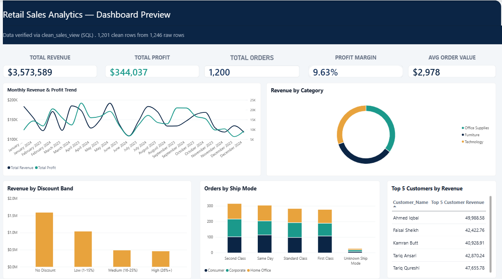
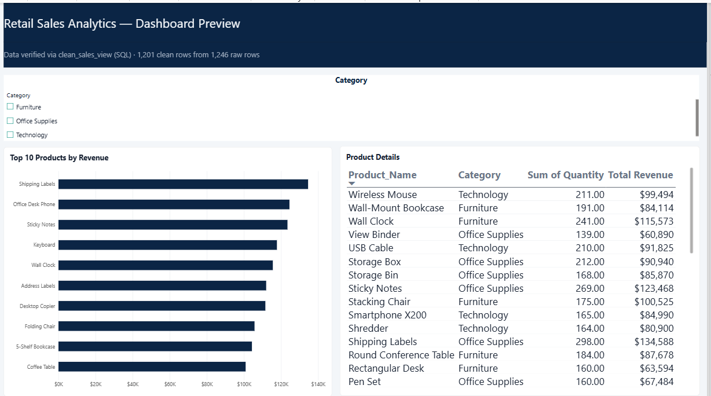
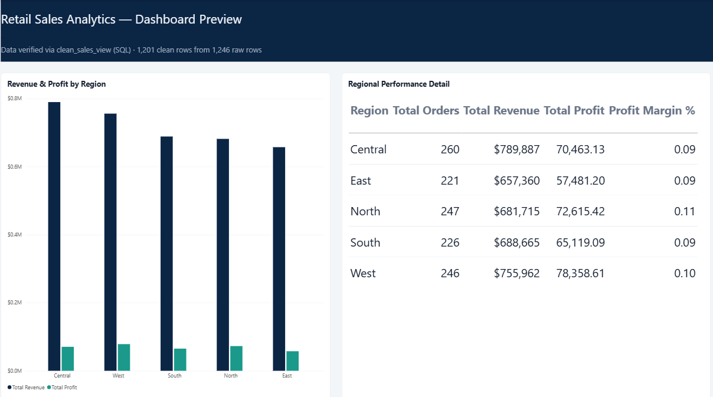

# End-to-End Retail Sales Analytics Pipeline

**An end-to-end analytics workflow — from messy raw data to an executive-ready Power BI dashboard.**

## The Problem

A retail business has sales data containing duplicate records, missing values, inconsistent text formatting, invalid values, and mixed date formats.

When raw data is not reliable, business reports can produce misleading results. The goal of this project is to transform the messy retail sales data into a clean, reliable dataset, analyze business performance using SQL, and present the results through an interactive Power BI dashboard.

The project focuses on answering practical business questions such as:

- How much revenue and profit is the business generating?
- Which regions are performing best?
- Which products generate the most revenue?
- How are sales changing over time?
- How do discounts relate to profit margin?
- Which customers contribute the most revenue?
- How does shipping performance vary across segments and shipping modes?

## Dataset

The project uses a simulated retail sales dataset containing **1,246 raw records and 16 columns**.

The dataset contains information about:

- Orders
- Order and Ship Dates
- Customers
- Customer Segments
- Regions and Cities
- Categories and Sub-Categories
- Products
- Quantity
- Unit Price
- Discount
- Sales
- Profit
- Ship Mode

### Data Quality Issues Identified

| Issue | Handling |
|---|---|
| Duplicate Order IDs / duplicate records | Investigated and duplicate records were removed after validation |
| Missing Customer Name | Replaced with `Unknown Customer` |
| Missing Region | Recovered where possible using related city information; remaining missing values were handled |
| Missing City | Recovered from duplicate records where possible; remaining values were labeled `Unknown City` |
| Missing Ship Mode | Recovered from duplicate records where possible; remaining values were labeled `Unknown Ship Mode` |
| Inconsistent Customer Name casing/whitespace | Standardized using trimming and casing corrections |
| Inconsistent Region values | Standardized to `Central`, `East`, `North`, `South`, and `West` |
| Negative Quantity values | Corrected using absolute values |
| Discount stored as whole numbers | Converted to decimal percentages |
| Missing Sales | Calculated using Quantity × Unit Price × (1 − Discount) |
| Mixed Order Date formats | Converted to `YYYY-MM-DD` |
| Fully blank record | Removed |
| Missing Profit | 3 values recovered from duplicate records; 17 values remained NULL because reliable profit information was unavailable |

After cleaning and duplicate validation:

**1,246 raw records → 1,201 final clean records**

The remaining **17 missing Profit values were intentionally kept NULL** rather than being guessed or artificially imputed.

## Phase 1 — Excel (Initial Data Review)

File: `Excel_SQL_PowerBI_Sales_Pipeline.xlsx`

Excel was used as the **first data-review stage** of the pipeline.

### What was done in Excel

- Reviewed the raw dataset
- Identified duplicate Order IDs
- Identified blank/missing values
- Checked inconsistent text formatting
- Used formulas such as `TRIM()`, `PROPER()`, and `IFERROR()` for data-quality practice
- Created a category-level summary using `SUMIF()` / `COUNTIF()`
- Documented the data-quality issues and their handling

### Why Excel?

Excel was used to understand the dataset and identify data-quality problems before moving the main cleaning workflow into SQL.

The detailed and repeatable cleaning process was then performed in SQL.

## Phase 2 — SQL (Cleaning & Analysis)

Database: `super_store_sales_data`

Main tables:

- `raw_sales` — original imported raw data
- `Backup_raw_sales` — safety backup of the raw data
- `Clean_sales` — final cleaned working table
- `Final_Clean_sales` — final clean backup

### SQL Cleaning

The cleaning workflow was separated into:

`01_cleaning_view.sql`

The process included:

- Creating a backup before modifying data
- Checking missing values
- Investigating duplicate Order IDs
- Recovering missing values from related duplicate records where reliable
- Standardizing customer names and regions
- Correcting negative quantities
- Standardizing discount values
- Calculating missing Sales values
- Standardizing date formats
- Removing the fully blank record
- Validating numeric and categorical values
- Removing remaining exact duplicate records
- Performing final data-quality checks

### Final Data Quality Result

| Quality Check | Result |
|---|---:|
| Final clean records | **1,201** |
| Missing Order ID | 0 |
| Missing Order Date | 0 |
| Missing Ship Date | 0 |
| Missing Ship Mode | 0 |
| Missing Customer Name | 0 |
| Missing Region | 0 |
| Missing City | 0 |
| Missing Quantity | 0 |
| Missing Unit Price | 0 |
| Missing Discount | 0 |
| Missing Sales | 0 |
| Missing Profit | **17** |
| Exact duplicate records | **0** |
| Negative Quantity | **0** |
| Invalid Discount | **0** |

The 17 remaining Profit values were not artificially estimated because the dataset did not contain enough reliable cost/margin information to calculate them accurately.

### SQL Analysis

The analytical workflow was separated into:

`02_analysis_queries.sql`

A SQL analysis view was created from the final clean data:

`Sales_Analysis_View`

The analysis covers:

- Total Revenue
- Total Profit
- Total Orders
- Average Order Value
- Revenue and Profit by Region
- Top 10 Products by Revenue
- Category and Sub-Category ranking
- Monthly Revenue and Profit Trend
- Running Revenue Total
- Regional Year-over-Year Growth
- Top 5 Customers by Revenue
- Shipping performance by Segment and Ship Mode
- Discount Band analysis

### Why SQL Analysis?

Cleaning answers:

> **"Can we trust the data?"**

SQL analysis answers:

> **"What does the data tell us about the business?"**

This makes SQL an important analytical stage between raw data preparation and Power BI visualization.

## Phase 3 — Power BI (Dashboard & Business Insights)

The cleaned SQL analysis data was connected to Power BI to create an interactive business dashboard.

### Dashboard Pages

#### 1. Overview

The Overview page provides a high-level view of business performance through:

- Total Revenue
- Total Profit
- Profit Margin %
- Total Orders
- Average Order Value
- Monthly Revenue & Profit Trend
- Revenue by Category
- Revenue by Discount Band
- Orders by Ship Mode and Segment
- Top 5 Customers



#### 2. Products

The Products page focuses on product-level performance:

- Top 10 Products by Revenue
- Product-level revenue
- Units sold
- Product Category
- Category filtering



#### 3. Regional

The Regional page focuses on geographic performance:

- Revenue by Region
- Profit by Region
- Regional performance comparison
- Total Orders
- Profit Margin %



### Core Power BI Measures

```DAX
Total Revenue = SUM(Sales_Analysis_View[Sales])

Total Profit = SUM(Sales_Analysis_View[Profit])

Total Orders = DISTINCTCOUNT(Sales_Analysis_View[Order_ID])

Average Order Value =
DIVIDE([Total Revenue], [Total Orders])
```

## Key Business Findings

### Regional Performance

The regional analysis shows that **Central generated the highest revenue**, while **North achieved the highest profit margin** among the five regions.

| Region | Revenue | Profit | Profit Margin |
|---|---:|---:|---:|
| Central | $789,887 | $70,463.13 | 9% |
| West | $755,962 | $78,358.61 | 10% |
| South | $688,665 | $65,119.09 | 9% |
| North | $681,715 | $72,615.42 | 11% |
| East | $657,360 | $57,481.20 | 9% |

**Business interpretation:** Revenue leadership and profitability leadership are not necessarily the same. Central leads in revenue, while North has the strongest profit margin.

### Discount Strategy vs. Profit Margin

The discount-band analysis produced an unexpected pattern in this dataset: higher discount bands show higher observed profit margins.

| Discount Band | Revenue | Profit Margin |
|---|---:|---:|
| No Discount | $1,592,508 | 9.20% |
| Low (1–15%) | $1,038,820 | 9.70% |
| Medium (16–25%) | $484,445 | 10.37% |
| High (26%+) | $457,816 | 12.24% |

**Important:** This shows an association in the dataset, not proof that higher discounts cause higher profit margins. The relationship should be investigated further using product mix, pricing, costs, and customer behavior before making a real pricing decision.

## Business Recommendations

1. **Investigate regional profitability**
   - Central has the highest revenue, while North has the highest margin.
   - Compare product mix, pricing, discounts, and costs across regions.

2. **Investigate high-discount transactions**
   - High-discount transactions show the highest observed margin in this dataset.
   - Before changing discount policy, investigate whether this is driven by particular products, customers, or transaction patterns.

3. **Monitor product-level performance**
   - Use the Top Products analysis to identify products that contribute strongly to revenue.
   - Compare revenue with quantity, discount, and profit before making inventory or promotion decisions.

4. **Use customer-level analysis**
   - The Top 5 Customer analysis can help identify high-value customers.
   - These customers can be monitored for repeat purchasing and revenue contribution.

5. **Continue improving data quality**
   - The 17 unresolved Profit values should be investigated at source.
   - Future data collection should include reliable cost or margin information so Profit can be calculated or validated accurately.

## Project Workflow

```text
Raw CSV Data
      ↓
Excel
Initial Data Review & Data Quality Checks
      ↓
SQL
Cleaning + Standardization + Validation
      ↓
Final Clean Dataset
1,201 Records
      ↓
SQL
Business Analysis
      ↓
Power BI
Interactive Dashboard
      ↓
Business Insights
      ↓
Business Recommendations
```

## Project Structure

```text
Retail Sales Data Pipeline/
│
├── Raw_Data/
│   └── superstore_sales_data_MESSY (2).csv
│
├── Excel/
│   └── Excel_SQL_PowerBI_Sales_Pipeline.xlsx
│
├── SQL/
│   ├── 01_cleaning_view.sql
│   └── 02_analysis_queries.sql
│
├── PowerBI/
│   └── Retail Sales Dashboard.pbix
│
├── README.md
│
└── Business Requirements/
    └── Business Requirements & Analysis Document
```

## Tools & Technologies

- **Microsoft Excel** — initial data review, formulas, data-quality checks, summaries
- **MySQL** — data storage, cleaning, transformation, validation, and business analysis
- **Power BI** — interactive dashboards, KPIs, visual analysis, and business storytelling
- **SQL** — aggregations, joins, ranking, trend analysis, and business metrics
- **DAX** — Power BI measures and calculated columns

## Skills Demonstrated

### Data Preparation
- Data quality assessment
- Missing-value handling
- Duplicate detection
- Data standardization
- Data validation
- Data transformation

### SQL
- `SELECT`
- `WHERE`
- `GROUP BY`
- `HAVING`
- `JOIN`
- `COUNT(DISTINCT)`
- Aggregations
- `CASE`
- `STR_TO_DATE()`
- `CAST()`
- `RANK()`
- `LAG()`
- Window functions
- Views

### Power BI
- KPI cards
- Interactive charts
- Tables and matrices
- Slicers
- DAX measures
- Calculated columns
- Business-focused dashboard design

### Business Analysis
- KPI definition
- Regional performance analysis
- Product performance analysis
- Customer analysis
- Discount analysis
- Trend analysis
- Business recommendations

## Resume Bullet

> **Built an end-to-end Retail Sales Analytics Pipeline using Excel, MySQL, and Power BI; cleaned and validated 1,246 raw records, produced a final 1,201-record dataset, performed SQL-based business analysis, and developed an interactive dashboard covering revenue, profit, orders, products, customers, regions, discounts, and shipping performance.**

## Project Outcome

This project demonstrates the complete workflow of a Data/Business Analyst:

**Understand the data → Identify data-quality problems → Clean and validate → Analyze business performance → Visualize insights → Recommend business actions.**

The project demonstrates that analytics is not only about creating charts. It is about turning unreliable raw data into **trustworthy information that can support business decisions.**
